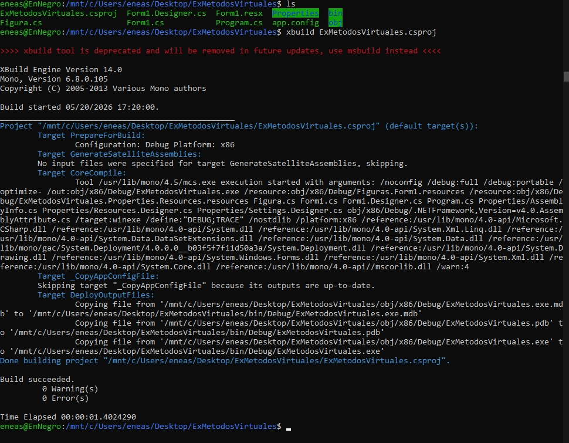
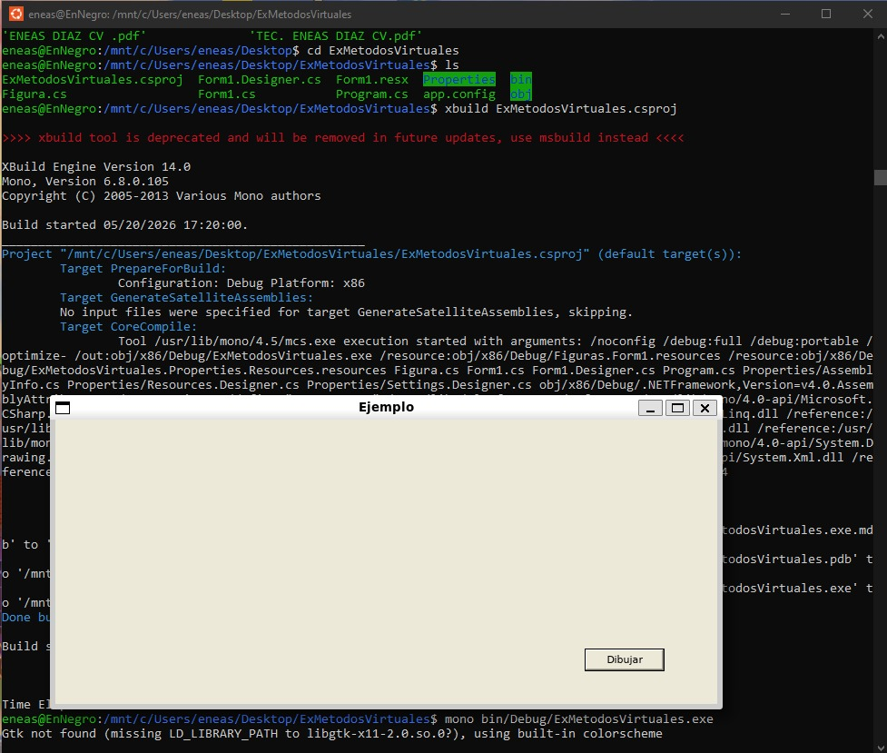
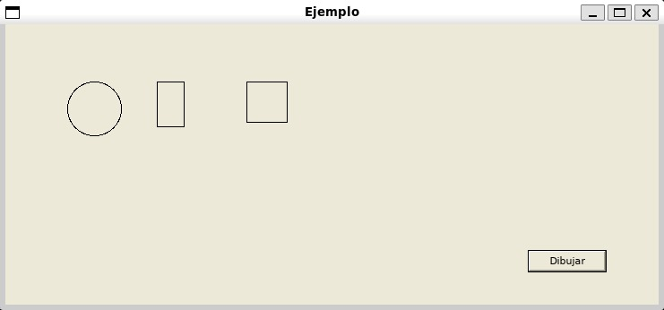

# Trabajo Práctico Especial - Intro a C# / .NET - Mono

## Integrantes

- Eneas

## Objetivo del trabajo

El objetivo de este trabajo fue compilar y ejecutar un proyecto de ejemplo desarrollado en C# utilizando Mono en un entorno Linux/Ubuntu.

El proyecto utilizado se llama `ExMetodosVirtuales` y trabaja conceptos introductorios de programación orientada a objetos en C#, principalmente herencia, métodos virtuales, sobrescritura de métodos y polimorfismo.

## ¿Qué es Mono?

Mono es una implementación de .NET que permite compilar y ejecutar aplicaciones desarrolladas en C# en sistemas operativos distintos de Windows, como Linux.

En este trabajo se utilizó Mono desde Ubuntu mediante WSL, es decir, el Subsistema de Windows para Linux.

## Instalación de Mono

Para instalar Mono en Ubuntu se utilizaron los siguientes comandos:

```bash
sudo apt update
sudo apt install mono-complete
```

## Capturas del proceso

### Verificación de Mono y xbuild


### Compilación exitosa



### Ejecución del programa



### Programa dibujando figuras

